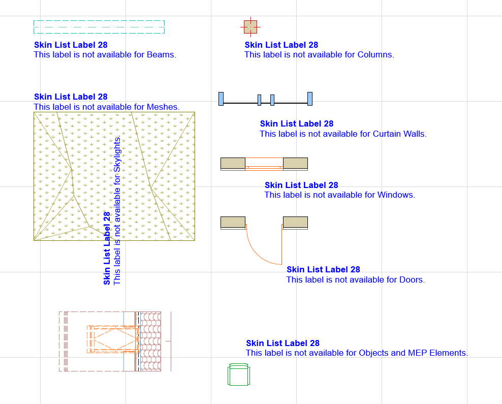
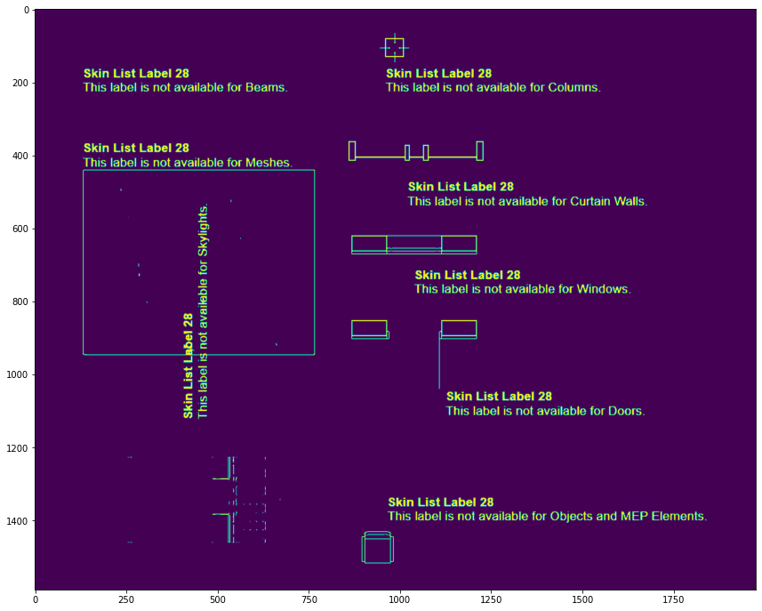

# Engineering Documentation

## Project Goal

The goal of this project is to extract text and related information (e.g., position) from screenshots of the Archicad software.

## Implemented Component Description

### Core Algorithm

The implemented component utilizes the latest version of the Tesseract OCR engine. The core algorithm includes a line-finding algorithm and an LSTM-based text classifier. Tesseract is chosen for its high performance, low computational complexity, and ease of implementation.

Tesseract generally performs well on images containing printed texts, but its efficiency significantly drops when there are texts with various orientation on one image or the text-background color contrast is not high enough or the image quality is bad (The provided test set contains plenty of these cases). Therefore simply applying Tesseract would not bring the desired results, I had to extend it with further steps. A high-level description of the steps carried out by the implemented component can be seen on the flowchart below:


### Preprocessing Steps

For each input image, the component performs preprocessing steps (ideas are based on the Tesseract documentation [ImproveQuality](https://tesseract-ocr.github.io/tessdoc/ImproveQuality)). These steps include upscaling (based on user-defined parameter), denoising, converting to grayscale, and applying OpenCV thresholding (OTSU or Adaptive). The effect of these steps can be seen on the example below:  

| Before preprocessing | After preprocessing |
|------------------------|-----------------------|
|  |  |

Additional preprocessing is applied for images with a dark background, where the algorithm highlights the blue color (determined from HSV format of the images).

#### Example:
| Before preprocessing | After preprocessing |
|------------------------|-----------------------|
|  |  |

Note that in case of images with low text-background contrast Adaptive threshold performs better than OTSU, so I recommend using that one. 

### Text Orientation Handling

To address Tesseract's limitations in processing text with various orientations, the following steps are taken:

1. The user defines a range of angles in degrees.
2. For each angle in the defined range:
   - Rotate the image.
   - Apply Tesseract on the rotated image.
   - Collect prediction results for all angles.
   - Transform results back to the original image coordinate system.
3. Non-Maximal Suppression is performed to eliminate double detections caused by processing the image at different angles.

### Evaluation

Manual evaluation of the component was performed on a set of 10 images with diverse features. The optimal hyperparameter settings determined from this evaluation are:
- confidence_threshold: 80
- rotation_range: (-45, 45, 5)
- apply_denoising: True
- thresholding_ethod: adaptive
- image_upscale_factor: 2

### Computational complexity

The inputs of the component is an image with dimensions W x H x 3. Let A be the number of different rotation angles applyied during execution. In this case the computational complexity of the component is:  **O(W x H x A)**, where **A** is considered as a constant hyper-parameter.

### Output

The script saves exported text, including position and rotation angle, in a .txt file under the specified folder (text_output_folder_path). Example output:

```
Found text: 200; Center position (in pixels): (818,539); Dimension (width, height): (30,16); Orientation (degrees): -25
Found text: 250; Center position (in pixels): (705,549); Dimension (width, height): (18,31); Orientation (degrees): 10
...
```

If `--save_visualization` is used, images with bounding boxes indicating recognized text are saved. Example:


## Setup Guide

### Required Python Modules

- `pytesseract==0.3.10`
- `tqdm==4.62.2`
- `numpy==1.23.5`
- `opencv-python==4.7.0.68`
- `matplotlib==3.4.3`
- `nms==0.1.6`

Requirements are included in `requirements.txt`.

### Additional steps when using the component on Windows

1. Install the Tesseract engine [here](https://digi.bib.uni-mannheim.de/tesseract/tesseract-ocr-w64-setup-5.3.3.20231005.exe).
2. Add the Tesseract path to `--tesseract_exe_path` when running `ocr_script.py`.

### Usage

Run the component using `ocr_script.py` 

## User Manual

The script has the following arguments:

### Arguments

- `--image_folder_path`: Path to the folder containing input images (required).
- `--tesseract_exe_path`: Path to the Tesseract engine (required on Windows).
- `--image_upscale_factor`: Integer value > 1 for upscaling low-resolution images (default 2).
- `--apply_denoising`: Apply OpenCV denoising algorithm (True/False).
- `--thresholding_method`: Thresholding algorithm (default None).
- `--confidence_threshold`: Confidence threshold for predictions (default 80).
- `--rotation_range`: Range of image rotation angles (from_angle to_angle step_size).
- `--text_output_folder_path`: Path to folder for saving extracted text in .txt files (default).
- `--save_visualizations`: Save visualizations with highlighted text (optional).
- `--visualization_folder_path`: Path to folder for saving visualizations (if desired).

### Example Command

```
python ocr_script.py --image_folder_path testfiles --tesseract_exe_path "C:\\Program Files\\Tesseract-OCR\\tesseract.exe" --confidence_threshold 80 --rotation_range -45 45 5 --apply_denoising --thresholding_method adaptive --image_upscale_factor 2 --save_visualizations
```
